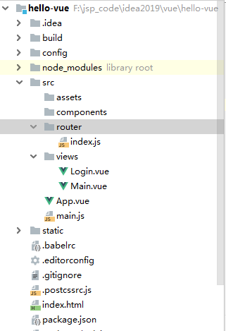
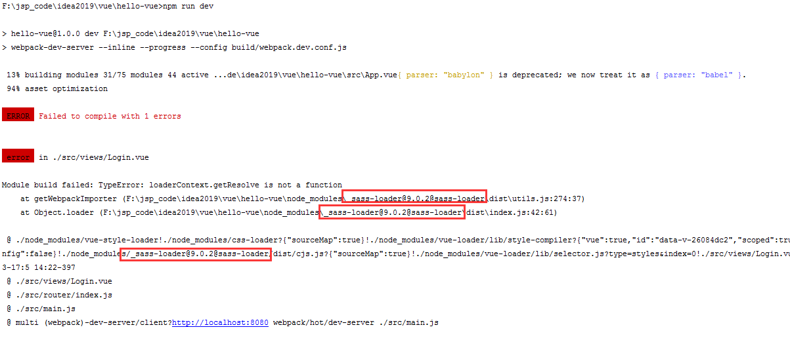
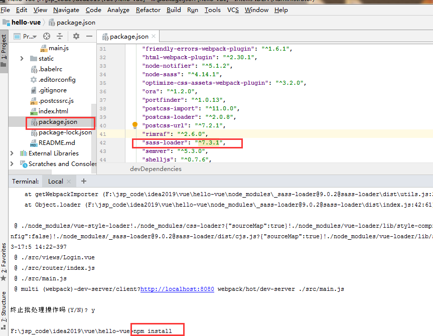
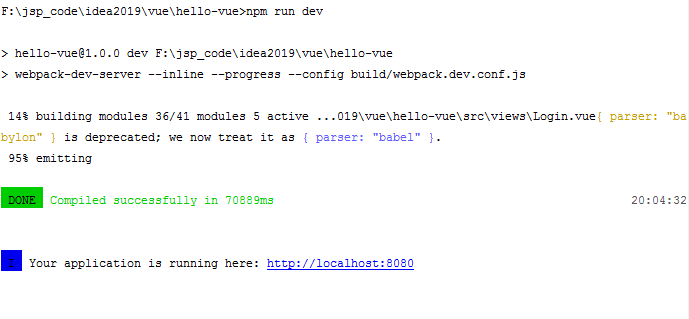
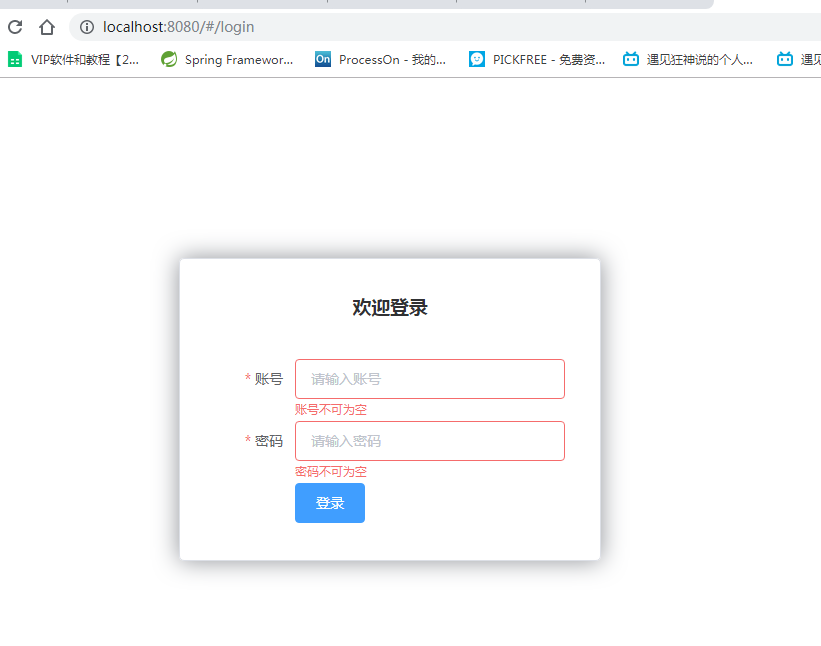
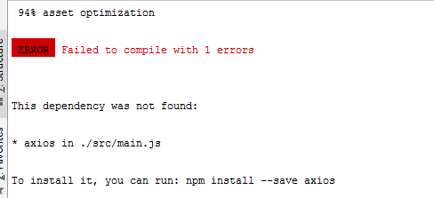

# 创建工程

<font color=red>注意：命令行都要使用管理员模式运行</font>
1、创建一个名为hello-vue的工程`vue init webpack hello-vue`
2、安装依赖， 我们需要安装vue-router、element-ui、sass-loader和node-sass四个插件

```shell
#进入工程目录
cd hello-vue
#安装vue-routern 
npm install vue-router --save-dev
#安装element-ui
npm i element-ui -S
#安装依赖
npm install
# 安装SASS加载器
cnpm install sass-loader node-sass --save-dev
#启功测试
npm run dev
```

3、Npm命令解释：

- `npm install moduleName`：安装模块到项目目录下
- `npm install -g moduleName`：-g的意思是将模块安装到全局，具体安装到磁盘哪个位置要看npm config prefix的位置
- `npm install -save moduleName`：–save的意思是将模块安装到项目目录下， 并在package文件的dependencies节点写入依赖，-S为该命令的缩写
- `npm install -save-dev moduleName`:–save-dev的意思是将模块安装到项目目录下，并在package文件的devDependencies节点写入依赖，-D为该命令的缩写

# 创建登录页面

  把没有用的初始化东西删掉！
  在源码目录中创建如下结构：

- assets：用于存放资源文件
- components：用于存放Vue功能组件
- views：用于存放Vue视图组件
- router：用于存放vue-router配置



  **创建首页视图，在views目录下创建一个名为Main.vue的视图组件：**

```html
<template>
	<div>首页</div>
</template>
<script>
	export default {
		name:"Main"
	}
</script>
<style scoped>
</style>
```

  创建登录页视图在views目录下创建名为Login.vue的视图组件，其中el-form的元素为ElementUI组件；

```html
<template>
  <div>
    <el-form ref="loginForm" :model="form" :rules="rules" label-width="80px" class="login-box">
      <h3 class="login-title">欢迎登录</h3>
      <el-form-item label="账号" prop="username">
        <el-input type="text" placeholder="请输入账号" v-model="form.username"/>
      </el-form-item>
      <el-form-item label="密码" prop="password">
        <el-input type="password" placeholder="请输入密码" v-model="form.password"/>
      </el-form-item>
      <el-form-item>
        <el-button type="primary" v-on:click="onSubmit('loginForm')">登录</el-button>
      </el-form-item>
    </el-form>

    <el-dialog
      title="温馨提示"
      :visible.sync="dialogVisible"
      width="30%">
      <span>请输入账号和密码</span>
      <span slot="footer" class="dialog-footer">
        <el-button type="primary" @click="dialogVisible = false">确 定</el-button>
      </span>
    </el-dialog>
  </div>
</template>

<script>
  export default {
    name: "Login",
    data() {
      return {
        form: {
          username: '',
          password: ''
        },

        // 表单验证，需要在 el-form-item 元素中增加 prop 属性
        rules: {
          username: [
            {required: true, message: '账号不可为空', trigger: 'blur'}
          ],
          password: [
            {required: true, message: '密码不可为空', trigger: 'blur'}
          ]
        },

        // 对话框显示和隐藏
        dialogVisible: false
      }
    },
    methods: {
      onSubmit(formName) {
        // 为表单绑定验证功能
        this.$refs[formName].validate((valid) => {
          if (valid) {
            // 使用 vue-router 路由到指定页面，该方式称之为编程式导航
            this.$router.push("/main");
          } else {
            this.dialogVisible = true;
            return false;
          }
        });
      }
    }
  }
</script>

<style lang="scss" scoped>
  .login-box {
    border: 1px solid #DCDFE6;
    width: 350px;
    margin: 180px auto;
    padding: 35px 35px 15px 35px;
    border-radius: 5px;
    -webkit-border-radius: 5px;
    -moz-border-radius: 5px;
    box-shadow: 0 0 25px #909399;
  }

  .login-title {
    text-align: center;
    margin: 0 auto 40px auto;
    color: #303133;
  }
</style>

```

创建路由，在router目录下创建一个名为`index.js`的vue-router路由配置文件

```js
import Vue from 'vue'
import VueRouter from 'vue-router'
import Main from '../views/Main'
import Login from '../views/Login'

Vue.use(VueRouter);

export default new VueRouter({
  routes:[
    {
      path:'/login',
      name:'login',
      component:Main
    },{
    path: '/main',
      name:'main',
      component: Login
    }
  ]
});

```

APP.vue

```html
<template>
  <div id="app">
    <router-view></router-view>
  </div>
</template>

<script>


export default {
  name: 'App',

}
</script>

<style>
#app {
  font-family: 'Avenir', Helvetica, Arial, sans-serif;
  -webkit-font-smoothing: antialiased;
  -moz-osx-font-smoothing: grayscale;
  text-align: center;
  color: #2c3e50;
  margin-top: 60px;
}
</style>
```

main.js

```js
// The Vue build version to load with the `import` command
// (runtime-only or standalone) has been set in webpack.base.conf with an alias.
import Vue from 'vue'
import App from './App'
import router from "./router"

import ElementUI from 'element-ui'
import 'element-ui/lib/theme-chalk/index.css'

Vue.use(router)
Vue.use(ElementUI)

/* eslint-disable no-new */
new Vue({
  el: '#app',
  router,
  render:h=>h(App)
})
```

# 运行项目

1. 输入命令

   ```shell
   npm run dev
   ```

2. 如果报错如下图：<font color=red>Module build failed: TypeError: loaderContext.getResolve is not a function</font>（sass-loader版本太高）

   

   <font color=red>解决:</font>

   1. 修改配置文件，重新安装
   		
      ```
      //1.修改sass-loader的版本为^7.3.1
      //2.重新安装配置环境
      npm install
      //或者
      cnpm install
      ```
      
      
      
   2. 卸载当前，重新下载
   
       ```shell
       // 卸载当前版本
       npm uninstall sass-loader
       // 安装7.3.1版本
       npm install sass-loader@7.3.1 --save-dev
       ```
   
   3. 如果报错为：<font color=red>Module build failed: Error: Cannot find module 'node-sass'</font>
   
       
   
       - npm执行
   
         ```shell
         npm install node-sass --save-dev
         ```
   
       - npm执行报错，则cnpm执行
   
         ```shell
         cnpm install node-sass --save
         ```
   
         - 如果cnpm没有安装
   
           ```shell
           npm install -g cnpm --registry=https://registry.npm.taobao.org
           
           //或者
           npm install -g cnpm
           ```
   
3. 再次执行终于成功

   ```shell
   npm run dev
   ```

   

   

   

# 路由嵌套

嵌套路由又称子路由，在实际应用中，通常由多层嵌套的组件组合而成。同样地，URL 中各段动态路径也按某种结构对应嵌套的各层组件，例如：

```shell
/user/foo/profile                     /user/foo/posts
+------------------+                  +-----------------+
| User             |                  | User            |
| +--------------+ |                  | +-------------+ |
| | Profile      | |  +------------>  | | Posts       | |
| |              | |                  | |             | |
| +--------------+ |                  | +-------------+ |
+------------------+                  +-----------------+
```

1. 用户信息组件，在 views/user 目录下创建一个名为 Profile.vue 的视图组件；

   ```vue
   <template>
       <div>
         <h1>个人信息</h1>
       </div>
   </template>
   
   <script>
       export default {
           name: "UserProfile"
       }
   </script>
   
   <style scoped>
   
   </style>
   ```

2. 用户列表组件在 views/user 目录下创建一个名为 List.vue 的视图组件；

   ```vue
   <template>
       <div>
         <h1>用户列表</h1>
       </div>
   </template>
   
   <script>
       export default {
           name: "UserList"
       }
   </script>
   
   <style scoped>
   
   </style>
   ```

3. 配置嵌套路由修改 router 目录下的 index.js 路由配置文件，代码如

   ```js
   import Vue from 'vue'
   import Router from 'vue-router'
   
   import Main from '../views/Main'
   import Login from '../views/Login'
   
   import UserList from '../views/user/List'
   import UserProfile from '../views/user/proFile'
   
   Vue.use(Router);
   
   export default new Router({
     routes: [
       {
         path: '/login',
         component: Login
       },
       {
         path: '/main',
         component: Main,
         children: [
           {
             path: '/user/profile',
             component: UserProfile
           },
           {
             path: '/user/list',
             component: UserList
           }
         ]
       }
     ]
   })
   
   ```

4. 修改首页视图，我们修改 Main.vue 视图组件，此处使用了 ElementUI 布局容器组件，代码如下：

   ```vue
   <template>
       <div>
         <el-container>
           <el-aside width="200px">
             <el-menu :default-openeds="['1']">
               <el-submenu index="1">
                 <template slot="title"><i class="el-icon-caret-right"></i>用户管理</template>
                 <el-menu-item-group>
                   <el-menu-item index="1-1">
                     <router-link to="/user/profile">个人信息</router-link>
                   </el-menu-item>
                   <el-menu-item index="1-2">
                     <router-link to="/user/list">用户列表</router-link>
                   </el-menu-item>
                 </el-menu-item-group>
               </el-submenu>
               <el-submenu index="2">
                 <template slot="title"><i class="el-icon-caret-right"></i>内容管理</template>
                 <el-menu-item-group>
                   <el-menu-item index="2-1">分类管理</el-menu-item>
                   <el-menu-item index="2-2">内容列表</el-menu-item>
                 </el-menu-item-group>
               </el-submenu>
             </el-menu>
           </el-aside>
   
           <el-container>
             <el-header style="text-align: right; font-size: 12px">
               <el-dropdown>
                 <i class="el-icon-setting" style="margin-right: 15px"></i>
                 <el-dropdown-menu slot="dropdown">
                   <el-dropdown-item>个人信息</el-dropdown-item>
                   <el-dropdown-item>退出登录</el-dropdown-item>
                 </el-dropdown-menu>
               </el-dropdown>
             </el-header>
   
             <el-main>
               <router-view />
             </el-main>
           </el-container>
         </el-container>
       </div>
   </template>
   
   <script>
       export default {
           name: "Main"
       }
   </script>
   
   <style scoped lang="scss">
     .el-header {
       background-color: #B3C0D1;
       color: #333;
       line-height: 60px;
     }
   
     .el-aside {
       color: #333;
     }
   </style>
   ```

   <font color=red>说明：</font>

   在元素中配置了用于展示嵌套路由,主要使用个人信息展示嵌套路由内容

## 参数传递

我们经常需要把某种模式匹配到的所有路由，全都映射到同个组件。例如，我们有一个 User 组件，对于所有 ID 各不相同的用户，都要使用这个组件来渲染。此时我们就需要传递参数了；

### 组件转发

#### $route方式

1. 修改路由配置, 

   - 主要是在 path 属性中增加了 :id，:name 这样的占位符

       ```js
       {
           path: '/main',
               component: Main,
                   children: [
                       {
                           path: '/user/profile/:id/:name',
                           name: 'UserProfile',
                           component: UserProfile
                       },
                       {
                           path: '/user/list',
                           component: UserList
                       }
                   ]
       }
       ```

2. 传递参数

   - 此时我们将 to 改为了 :to，是为了将这一属性当成对象使用，
   
   - 注意 router-link 中的 name 属性名称一定要和路由中的name 属性名称 匹配，因为这样 Vue 才能找到对应的路由路径；
   
     ```vue
     <!--name:传组件名， params：传递参数， 需要对象： v-bind-->
     <router-link :to="{name:'UserProfile',params:{id:1,name:'狂神'}}">个人信息</router-link>
     ```
   
3. 接收参数, 在目标组件中

   ```vue
   <div>
       <h1>个人信息</h1>
       {{$route.params.id}}
       {{$route.params.name}}
   </div>
   ```

   

#### 使用 props 的方式

1. 修改路由配置 , 主要增加了 props: true 属性

   ```js
   routes: [
       {
         path: '/login',
         component: Login
       },
       {
         path: '/main',
         component: Main,
         children: [
           {
             path: '/user/profile/:id/:name',
             name: 'UserProfile',
             component: UserProfile,
             props: true
           },
           {
             path: '/user/list',
             component: UserList
           }
         ]
       }
     ]
   ```

2. 传递参数和之前一样

3. 接收参数为目标组件增加 props 属性

   ```vue
   <div>
       <h1>个人信息</h1>
       {{id}}
       {{name}}
   </div>
   ```

   

### 组件重定向

- 重定向的意思大家都明白，但 Vue 中的重定向是作用在路径不同但组件相同的情况下，比如：

  ```js
  {
      path: '/goHome',
      redirect: '/main'
  }
  ```

- 说明：这里定义了两个路径，一个是 /main ，一个是 /goHome

  - 其中 /goHome 重定向到了 /main 路径，由此可以看出重定向不需要定义组件；

- 使用的话，只需要设置对应路径即可；

  ```vue
  <el-menu-item index="1-3">
      <router-link to="/goHome">回到首页</router-link>
  </el-menu-item>
  ```

  

# 路由模式与 404

## 路由模式有两种

- hash：路径带 # 符号，如 http://localhost/#/login

  - 默认为hash路由模式

    ```js
    export default new Router({
      routes: []
    })
    ```

    

- history：路径不带 # 符号，如 http://localhost/login

  - history路由模式

    ```js
    export default new Router({
      mode: 'history',
      routes: []
    })
    ```

## 404

1. 创建一个名为 `NotFound.vue` 的视图组件，代码如下：

   ```vue
   <template>
       <div>
         <h1>404,你的页面走丢了</h1>
       </div>
   </template>
   
   <script>
       export default {
           name: "NotFound"
       }
   </script>
   
   <style scoped>
   
   </style>
   
   ```

2. 修改路由配置，代码如下：

   ```js
   import NotFound from '../views/NotFound'
   
   export default new Router({
     mode: 'history',
     routes: [
   	{
          path: '*',
          component: NotFound
       }
     ]
   })
   ```

   

# 路由钩子与异步请求

## 路由钩子

- `beforeRouteEnter`：在进入路由前执

- `beforeRouteLeave`：在离开路由前执行

  ```js
  export default {
        name: "UserProFile",
        props: ['id','name'],
        beforeRouteEnter: (to,from,next) => {
          console.log('进入路由之前')
          next()
        },
        beforeRouteLeave: (to,from,next) => {
          console.log('进入路由之后')
          next()
        }
      }
  ```

参数说明：

- to：路由将要跳转的路径信息
- from：路径跳转前的路径信息
- next：路由的控制参数
- next() 跳入下一个页面
- next(’/path’) 改变路由的跳转方向，使其跳到另一个路由
- next(false) 返回原来的页面
- next((vm)=>{}) 仅在 beforeRouteEnter 中可用，vm 是组件实例

## 异步请求

1. 安装 Axios `cnpm install --save vue-axios`

2. `main.js`引用 Axios

   ```js
   import axios from 'axios'
   import VueAxios from 'vue-axios'
   
   Vue.use(VueAxios, axios)
   ```

3. 准备数据 ： 只有我们的 static 目录下的文件是可以被访问到的，所以我们就把静态文件放入该目录下`static/mock/data.json`。

   ```json
   {
     "name": "狂神说Java",
     "url": "https://blog.kuangstudy.com",
     "page": 1,
     "isNonProfit": true,
     "address": {
       "street": "含光门",
       "city": "陕西西安",
       "country": "中国"
     },
     "links": [
       {
         "name": "bilibili",
         "url": "https://space.bilibili.com/95256449"
       },
       {
         "name": "狂神说Java",
         "url": "https://blog.kuangstudy.com"
       },
       {
         "name": "百度",
         "url": "https://www.baidu.com/"
       }
     ]
   }
   ```

4. 运行项目`npm run dev`看是否正常

   - 因为cnpm可能安装失败，重新安装一下`cnpm install --save vue-axios`

   

5. 在 beforeRouteEnter 中进行异步请求

   ```js
   export default {
       name: "UserProFile",
       props: ['id','name'],
       beforeRouteEnter: (to,from,next) => {
           console.log('进入路由之前');//加载数据
           next(vm => {
               vm.getData();//进入路由之前执行getData()
           })
       },
       beforeRouteLeave: (to,from,next) => {
           console.log('进入路由之后');
           next()
       },
       methods: {
           getData() {
               this.axios({
                   method: 'get',
                   url: 'http://localhost:8080/static/mock/data.json'
               }).then((response) => {
                   console.log(response)
               })
           }
       }
   }
   ```

   